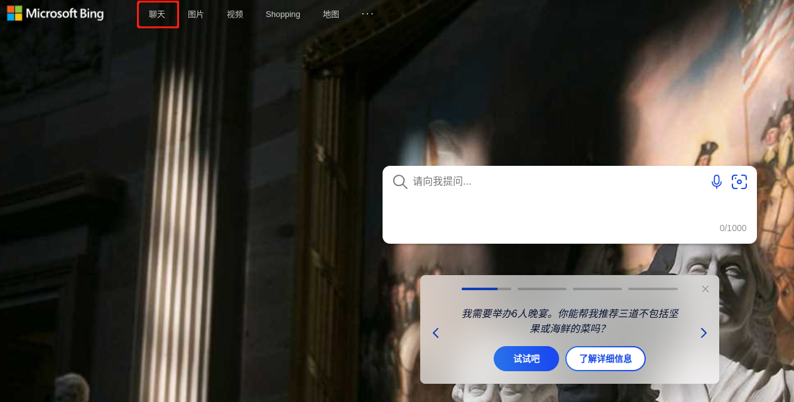
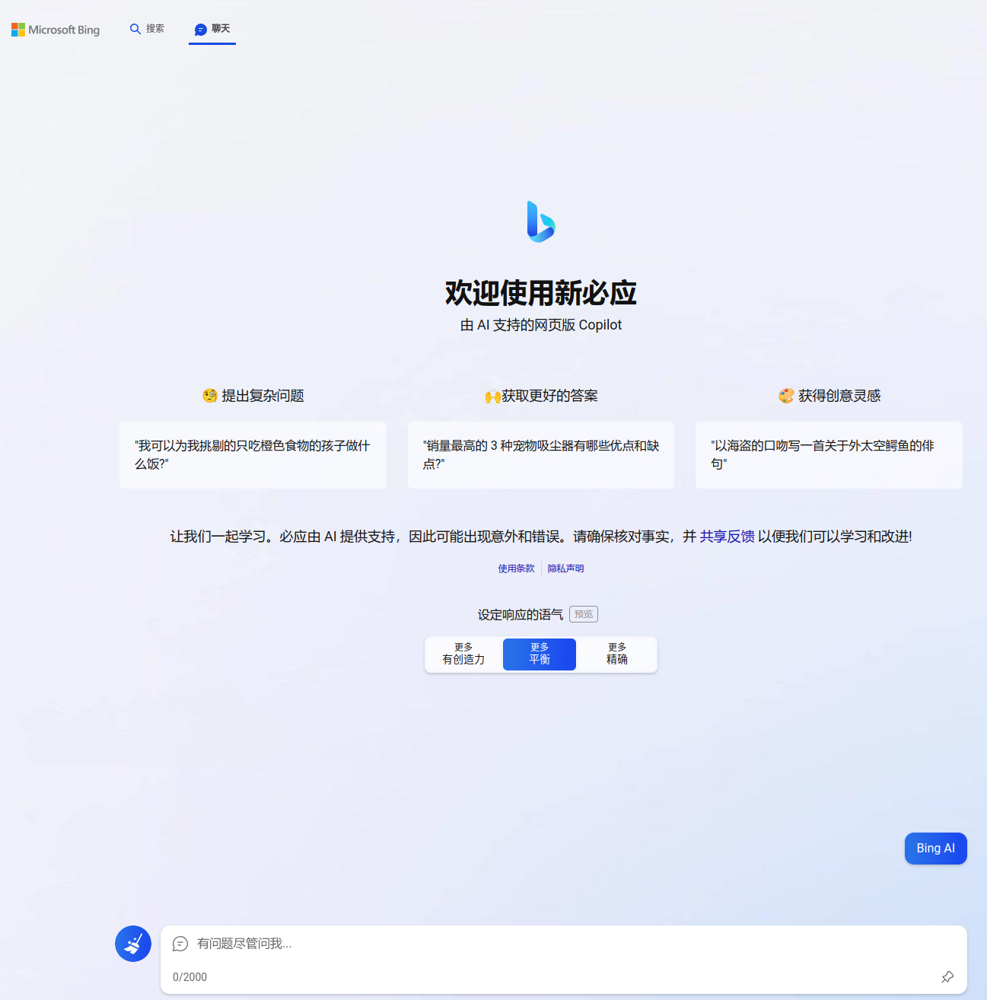

关于chatGPT与newBing的申请
=====

# chatGPT
在国内想使用chatGPT比较麻烦，因为openAI做了两个限制:
- 注册openAI账户时要发送激活码到手机，但是它不允许使用中国地区的手机号。
- 访问openAI时，它会检查你的IP，并禁止中国地区IP的访问，包括香港。

因此你需要:

1. 科学上网，这个需要自己发挥聪明才智。
2. 去弄个境外手机短信服务，用来在注册的时候接收激活码。(比如在`https://sms-activate.org/`上购买手机号服务)

第一点靠大家自己八仙过海各显神通，第二点的话，网上已经有大量的教程，这里就不赘述了。

> 然后，等你注册好开始使用chatGPT以后，你会发现它动不动就说你在过去一个小时提了太多问题，但其实你才刚打开chatGPT，一个问题都还没问。。。
> 
> 所以真要把chatGPT当作工作助手的话，大概要购买plus服务，一个月20刀。。。用不起用不起。。。

# newBing
new bing目前不需要科学上网，不需要境外手机服务，你需要做的是:

1. 注册一个微软账户(`https://account.microsoft.com/`)，国内的邮箱就可以，比如我就用qq邮箱注册的。
2. 由于咱们访问`bing.com`时会自动跳转到`cn.bing.com`，所以需要为本地edge浏览器安装一个用来修改http头属性`X-Forwarded-For`的插件，比如ModHeader，这个网上也有很多教程，这里也不多说了。或者直接使用dev版本的edge，这个方式我没试过，据说可以。
3. 访问`bing.com/new`，按照提示申请加入newBing的候补队列，微软的东西做的不太友好，我当时一顿瞎操作，也不知道怎么就加入候补队列了。。。加入成功的话，你的微软帐号注册邮箱会收到一封邮件：`You're on the waitlist for the new Bing!`，然后就且等着吧。。。
   > 微软号称做了这两个事情可以更快地通过候补正式使用newBing: 一个是本地edge浏览器的home页面设置为bing，另一个是手机上下载bing浏览器，并用同一个微软账户登录他们(PC浏览器和手机浏览器)。
4. 大概一周以后，你可能会收到通知你已经可以使用newBing了的邮件:`You're in! Welcome to the new Bing!`。。。我当时21号进入候补队列，25号收到`you are in`的通知。。。
5. 此时你重新打开edge(ModHeader要一直开着)，然后访问`bing.com`，只要不跳到`cn.bing.com`，你就可以在上方菜单里找到聊天，点击它，就可以开始浪了。

new bing 可以使用的话，你就能看到这个"聊天"按钮

点击后来到聊天页面:

当然，它经常挂掉，每次会话只能提5个问题，没有有趣的灵魂，脾气也不太好。。。emmm。。。就这样吧。。。
